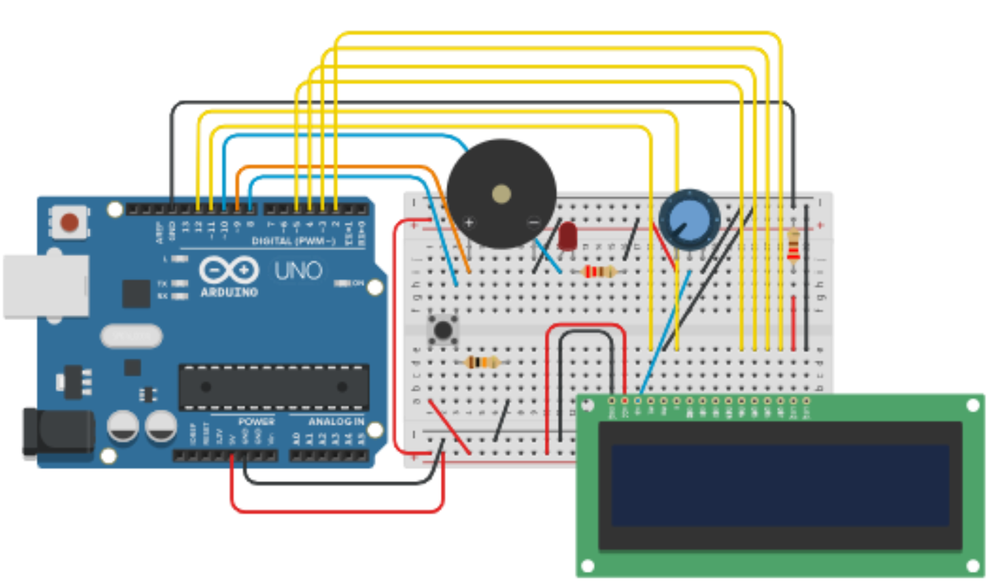
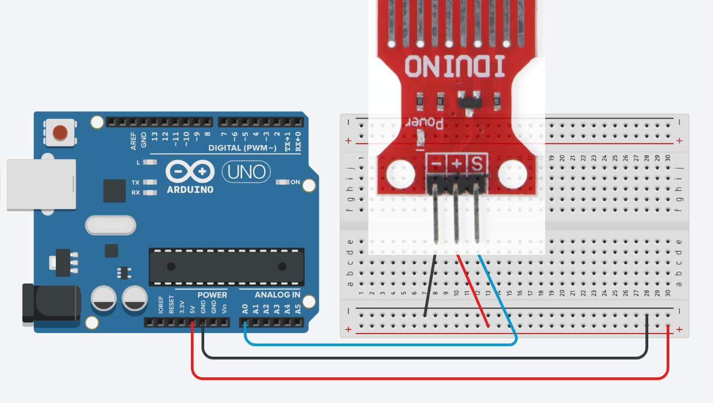
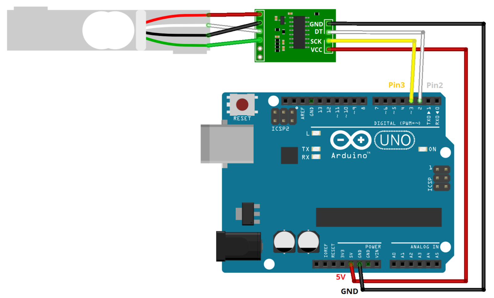
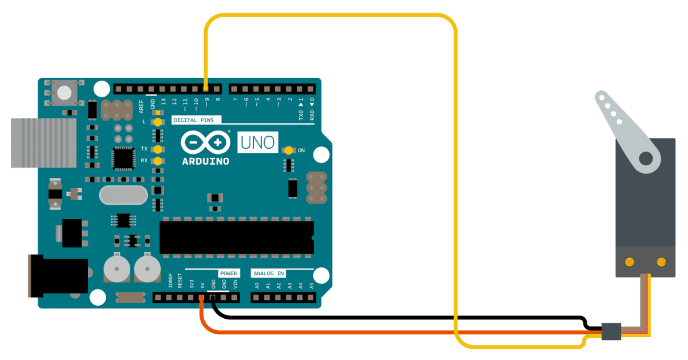
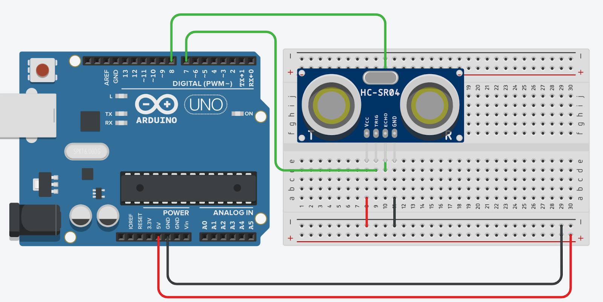

# ACDC (Active Cat Detection Companion) - Project Proposal

## Team Information

**Group Number:** 37

- **Adam Aubry**
- **John Gutama**
- **Elizabeth Cardoso**
- **John Leveille**

---

## Abstract

ACDC (Active Cat Detection Companion) helps cat owners monitor and care for their pets by tracking food, water, and treats using multiple Arduinos. One Arduino measures food weight, another tracks water level, a third dispenses treats when a specific cat is detected via RFID, and a fourth manages alerts and overall communication. Data is shared wirelessly for easy monitoring. A buzzer and LED notify owners when the cat approaches. Unlike typical feeders using cameras, ACDC uses accurate sensors and RFID detection for personalized, reliable feeding, ensuring no bowl runs empty and every cat receives proper attention.

---

## Detailed Project Ideas

Our idea is to create a useful way to monitor your cat's water, food, and treat usage. We want to make sure their water bowl is never empty, their food never low, and keep their treats always stocked. We do this by attaching monitors to their feeding bowls that alert us when their supply is low. This then lets us make sure to refill their containers.

Additionally, we plan to include a treat dispenser that will detect when a specific cat is present to give an appropriate amount of treats. The treat dispenser will only be triggered when the cat with a specific collar ID is present by using RFID technology to detect and differentiate the cat's IDs.

### System Components

- **Arduino 1 (Food Monitor):** This will be accomplished through a weight scale. If the food weight goes under a certain amount, the monitor will alert the user, priming them to fill the food bowl.
- **Arduino 2 (Water Monitor):** The monitor will be a Solu SL067 water level sensor, letting us know when the water level drops below a certain level, prompting us to refill the water.
- **Arduino 3 (Treat Dispenser):** The treat dispenser will only be triggered when the cat with a specific collar ID is present by using RFID technology. The dispenser uses a motor to rotate and dispense a treat (similar to a gumball machine).
- **Arduino 4 (Alert System/Controller):** Used as an alert system keeping track of all the other monitors. It also acts as a manual control for the treat dispenser where the user can press a button to dispense a treat.

### Communication

The communication between all Arduinos will be done mainly through Wi-Fi. For the cat treat dispenser, we will also be using Bluetooth/RFID. An RFID (Radio Frequency Identification) receiver (RC522) will send out an RF signal to power passive tags attached to the cat's collar and receive the tag's backscattered response. The response will be decoded by the RC522 module and sent to the Arduino through the Serial Peripheral Interface (SPI). The Arduinos themselves will use Wi-Fi to share information with the controller (Arduino 4).

### Functional Logic

1.  **Weight Scale Input:** Tracks the amount of food in a bowl.
2.  **Water Level Sensor Input:** Tracks the amount of water.
3.  **Proximity Sensor Input:** Senses when a cat is near the dispenser.
4.  **LED Output:** Indicates that the cat is near the dispenser.
5.  **Sound Buzzer:** Indicates that the cat is near the dispenser.
6.  **Pushbutton/RF Signal Input:** Triggers a treat to be dispensed.
7.  **Servo Motor Output:** Spins the treat dispenser handle.
8.  **RFID Tag/Reader:** Transmits data (Cat ID) when the cat is close to the dispenser.

**Differentiation:**
The project already exists as automatic cat feeders are common, but what sets us apart is the specific sensor suite and treat feature. We are specifically using Arduino sensors to check the weight of the cat food and adding a water level sensor. Most cat dispensers use a camera to measure this. In a way, our dispenser would be more accurate than a camera sensor.

---

## Proposed Timeline of Development

- **Week of 10/13/25:** Starting the project.
- **Week of 10/20/25:** Creating hardware diagrams and preparing for Design Presentation.
- **Week of 10/27/25:** Design Presentation (Monday 10/27/25). Should have all materials and at least one semi-working Arduino.
- **Week of 11/03/25:** Hardware for Arduino 1 done; work on 2nd and 3rd Arduino.
- **Week of 11/10/25:** Hardware for Arduino 2 done; halfway through 3rd Arduino; starting on 4th Arduino.
- **Week of 11/17/25:** Hardware for all Arduinos completed; establishing communication between Arduinos.
- **Week of 11/24/25:** Final testing, debugging, and preparation for demonstration.
- **Week of 12/01/25:** Project Demonstration (Monday 12/01/25).

---

## List of Materials Needed

- Wires
- Resistors
- Breadboards
- LEDs
- 1x LCD
- 1x Solu SL067 water level sensor
- 1x Motor
- 1x HC-SR04 Ultrasonic sensor
- 1x Load Cell
- 1x HX711 Amplifier
- 1x Passive buzzer
- 1x Small button

---

## Diagrams

### 1. Alert System Diagram



### 2. Water Level Sensor Diagram



### 3. Food Level (Load Cell) Diagram



### 4. Treat Dispenser (Servo Motor) Diagram



### 5. Treat Dispenser (Ultrasonic Sensor) Diagram



---

## Code Sketches (Pseudo-code)

### Arduino ID: Master/Hub

**Description:** This Arduino acts as an Access Point. Other Arduinos connect to this hub to report data. An LCD reports the data.

```cpp
/* Global Variables:
- food_level (FLOAT)
- water_level (STRING)
- cat_id_present (STRING)
- is_cat_nearby (BOOLEAN)
*/

void setup() {
    // 1. Initialize WiFi in Access Point mode
    // 2. Start server to listen for clients
    PRINT("ACDC Hub is online. Waiting for connections...");

    // 3. Initialize LCD Screen
    LCD.print("ACDC System Boot");
    LCD.print("Waiting for data...");

    // 4. Set defaults
    food_level = 0.0;
    water_level = "UNKNOWN";
}

void loop() {
    // 1. Check for client connections
    if (client_connected) {
        // 2. Read incoming data string

        // 3. Process data
        if (data.startsWith("FOOD:")) {
            food_level = extractValue(data);
            update_display();
        }
        else if (data.startsWith("WATER:")) {
            water_level = extractStatus(data);
            update_display();
        }
        else if (data.startsWith("PROXIMITY:NEAR")) {
            is_cat_nearby = TRUE;
            PRINT("Cat is near. Alerting...");
        }

        // 4. Disconnect client
    }
}

void update_display() {
    LCD.clear();
    // Line 1: F:250.5g W:OK
    LCD.print("F:" + food_level + "g W:" + water_level);
    // Line 2: Cat ID: A7B4C1
    LCD.print("Cat ID: " + cat_id_present);
}
```

### Arduino ID: Water Sensor

**Description:** Reads water level data and sends it to the Master Hub.

```cpp
/*
Global Variables:
- WIFI_SSID, WIFI_PASSWORD, HUB_IP
- WATER_SENSOR_PIN (A0)
- LOW_WATER_THRESHOLD (400)
*/

void setup() {
    pinMode(WATER_SENSOR_PIN, INPUT);
    // Connect to Master Hub WiFi
    while (!WiFi.connected) {
        wait(500);
    }
}

void loop() {
    // 1. Read sensor
    int sensor_value = analogRead(WATER_SENSOR_PIN);
    String water_status;

    // 2. Determine status
    if (sensor_value < LOW_WATER_THRESHOLD) {
        water_status = "LOW";
    } else {
        water_status = "OK";
    }

    // 3. Connect to Hub and send data
    if (connectToHub()) {
        String message = "WATER:" + water_status;
        send(message);
    }

    // 4. Wait 30 seconds to avoid spamming network
    delay(30000);
}
```

### Arduino ID: Food Weight

**Description:** Reads current weight of food via Load Cell/HX711 and sends to Master Hub.

```cpp
/*
Global Variables:
- WIFI_SSID, WIFI_PASSWORD, HUB_IP
- LOADCELL_DOUT_PIN (3), LOADCELL_SCK_PIN (2)
- CALIBRATION_FACTOR (-450.5)
*/

void setup() {
    // 1. Initialize Scale
    scale.begin(DOUT, SCK);
    scale.set_scale(CALIBRATION_FACTOR);

    // 2. Tare scale (assume empty bowl at startup)
    scale.tare();

    // 3. Connect to WiFi
    connectToWiFi();
}

void loop() {
    // 1. Read weight
    float current_weight = scale.get_units();
    if (current_weight < 0) current_weight = 0.0;

    // 2. Connect to Hub and send
    if (connectToHub()) {
        String message = "FOOD:" + current_weight;
        send(message);
    }

    // 3. Wait 30 seconds
    delay(30000);
}
```

### Arduino ID: Treat Dispenser

**Description:** Detects proximity. If cat is within 1 foot, turns servo 180 degrees to drop treat, then resets. Includes cooldown timer.

```cpp
/*
Global Variables:
- PROXIMITY_SENSOR_PIN (7)
- SERVO_MOTOR_PIN (9)
- TRIGGER_DISTANCE_CM (30)
- COOLDOWN_PERIOD_MS (300000) // 5 minutes
- last_dispense_time
*/

void setup() {
    pinMode(PROXIMITY_SENSOR_PIN, INPUT);
    servo.attach(SERVO_MOTOR_PIN);
    servo.write(0); // Closed position

    // Set time to allow immediate use
    last_dispense_time = -COOLDOWN_PERIOD_MS;
}

void loop() {
    long current_time = millis();

    // Check cooldown
    if ((current_time - last_dispense_time) >= COOLDOWN_PERIOD_MS) {

        int distance = readDistance(PROXIMITY_SENSOR_PIN);

        if (distance < TRIGGER_DISTANCE_CM) {
            PRINT("Cat detected! Dispensing...");
            dispense_treat();
            last_dispense_time = current_time;
        }
    }
    delay(100);
}

void dispense_treat() {
    servo.write(180); // Open
    delay(1000);
    servo.write(0);   // Close
    delay(1000);
}
```

---

## List of References

- [Getting Started with HC-SR04 Ultrasonic Sensor](https://projecthub.arduino.cc/Isaac100/getting-started-with-the-hc-sr04-ultrasonic-sensor-7cabe1)
- [Arduino Basic Servo Control](https://docs.arduino.cc/tutorials/generic/basic-servo-control/)
- [Setting up Load Cell with HX711](https://randomnerdtutorials.com/arduino-load-cell-hx711/#setting-load-cell)
- [Interfacing Arduino with PIR Motion Sensor](https://projecthub.arduino.cc/electronicsfan123/interfacing-arduino-uno-with-pir-motion-sensor-593b6b)
- [Communicating between two Arduinos via Serial](https://forum.arduino.cc/t/getting-two-arduinos-to-communicate-through-serial/540621)
- [Arduino UNO R4 WiFi Examples](https://docs.arduino.cc/tutorials/uno-r4-wifi/wifi-examples/)
- [Arduino WiFi Library Documentation](https://docs.arduino.cc/libraries/wifi/)
- [Water Level Monitor Tutorial](https://projecthub.arduino.cc/NewMC/water-level-monitor-09c018)
